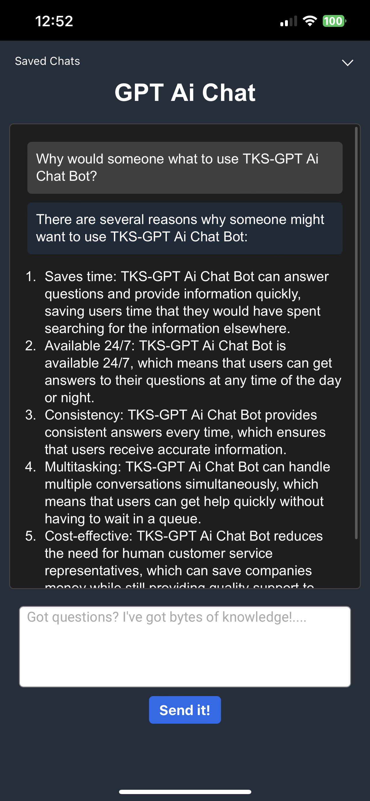
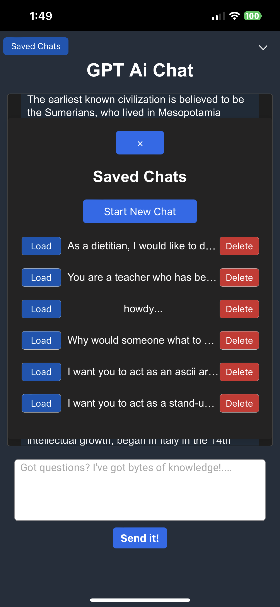
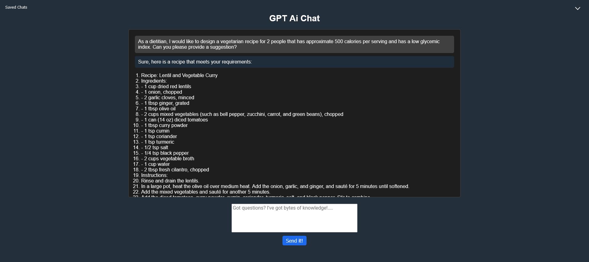

# TKS-GPT    


## Run your own AI Chat Bot 🤖

</br>

Works with GPT 3.5 turbo and chat history but should also work with Chat GPT 4 you just need the api key for it. Is able to do lists, bullet points, email templates and code blocks. Saved chat history, huge list of prompts added ⌵

Add your Open AI API Key and run it on your local network http://localhost:5000 or with https:// your.domain.com either one works!

</br>


1. [Clone the repo](#clone-the-repo)
2. [Install with Docker CLI / Docker Compose](#install-with-docker-cli--docker-compose)
3. [Build on Ubuntu or Debian](#build-on-ubuntu-or-debian)
4. [Set up a Cloudflare Tunnel for HTTPS optional](#set-up-a-cloudflare-tunnel-for-https-optional)
5. [Run on a devcontainer VScode](#run-on-a-devcontainer-vscode)


</br>

<p align="center">

</br>
<strong>Host your own Ai Chat bot</strong>
</p>

---

</br>

<p align="center">

</br>
<strong>Save, Load and Delete Chats</strong>
</p>

</br>

---

</br>

<p align="center">

</br>
<strong>wide view</strong>
</p>

</br>

---

</br>

### Tree View

```bash

Project Root
├── TKS-GPT
│   ├── app.py (Flask Backend)
│   ├── .env (Environment Variables)
│   ├── venv (Virtual Environment)
│   └── ...
└── chatbot-ui (React Frontend)
    ├── package.json (Dependencies and scripts)
    ├── src
    │   ├── App.js (Main component, includes axios API call)
    │   └── ...
    └── build (Generated by 'npm run build')

```

</br>

### Built with python, flask, node.js and react for x86_64 (amd64) architectures and should work on docker desktop also. 

</br>


## Clone the repo
---
</br>

```bash
git clone https://github.com/bigsk1/TKS-GPT.git
```

```bash
cd TKS-GPT
```
</br>


## Install with Docker CLI / Docker Compose

### The simplest way is with Docker - pull straight from dockerhub

https://hub.docker.com/r/bigsk1/tks-gpt

---
</br>
Docker


```bash
docker run -d -p 5000:5000 --name tks-gpt --env OPENAI_API_KEY=your_openai_api_key --restart always bigsk1/tks-gpt:latest
```

</br>

Docker compose

```bash
version: '3.8'

services:
  app:
    image: bigsk1/tks-gpt:latest
    environment:
      - OPENAI_API_KEY=<your_openai_api_key>
    ports:
      - "5000:5000"
    restart: unless-stopped
    security_opt:
      - no-new-privileges:true
```

</br>

### Build the image yourself
---

You can use docker cli in same folder as the Dockerfile

```bash
docker build -t your_image_name .
```
```bash
docker run -d -p 5000:5000 --name tksgpt-container --env OPENAI_API_KEY=ENTER_YOUR_OPEN_AI_APIKEY_HERE your_image_name
```

or
</br>

In the docker-compose.yml file add your Open AI Api key 

```bash
version: '3.8'

services:
  app:
    build: .
    image: your_custom_image_name
    restart: unless-stopped
    environment:
      - OPENAI_API_KEY=your_openai_api_key
    ports:
      - "5000:5000"
```
and then 
```bash
docker-compose up -d
```
Your app will be running on http://localhost:5000 use it as is or add ssl both work with no code change needed. 

</br>


## Build on Ubuntu or Debian
---
</br>

THERE ARE TWO PARTS TO YOUR PROJECT A BACKEND AND A FRONTEND
### BACKEND - python3 and flask
</br>

Active Virtual Enviroment ( optional but recommended )


For Python, you'll need to create a virtual environment. In your project directory, run:

```bash
python3 -m venv venv
```
Activate the virtual environment:

```bash
source venv/bin/activate
```

Install Python dependencies:

With the virtual environment activated, install the required Python packages using the requirements.txt file:

```bash
pip install -r requirements.txt
```
Exit out of virtual enviroment and back to the TKS-GPT folder type deactivate


</br>

### FRONTEND - node and react


Install Node.js and npm:

Make sure Node.js and npm are installed on your system. You can check if they are installed by running:

```bash
node -v
npm -v
```
You need Node version 18+


If not installed, you can download them from the official Node.js website https://nodejs.org/en/download/

</br>

See here https://github.com/nodesource/distributions

Install frontend dependencies:

### Ubuntu 22.04

---

Node (v19.x) to current
```bash
sudo apt update
sudo apt install -y curl
```
```bash
curl -fsSL https://deb.nodesource.com/setup_current.x | sudo -E bash - &&\
sudo apt-get install -y nodejs
```
```bash
sudo apt-get install -y build-essential
```

### Debian

---

Node (v19.x) to current
```bash
sudo apt install curl
```
```bash
curl -fsSL https://deb.nodesource.com/setup_current.x | bash - &&\
apt-get install -y nodejs
```
run as root on debian
```bash
apt-get install -y build-essential
```
</br>

Navigate to the frontend folder (the folder containing the package.json file, e.g., chatbot-ui), and install the required npm packages:

```bash
cd chatbot-ui
npm install
```

To connect the front-end to the back-end


Install Axios in your chatbot-ui folder:

```bash
npm install axios
```

Set up environment variables:  

Make sure you have a .env file in (TKS-GPT folder) with the required environment variables (such as OPENAI_API_KEY). 

### Change .env.template to .env
</br>

After completing these steps, you should be able to run both the backend and frontend servers and start using your chatbot application.

### TREE VIEW

```bash
TKS-GPT
├── app.py
├── chatbot-ui
│   ├── build
│   │   └── ...
│   ├── node_modules
│   │   └── ...
│   ├── public
│   │   └── ...
│   ├── src
│   │   ├── App.css
│   │   ├── App.js
│   │   ├── App.test.js
│   │   ├── index.css
│   │   ├── index.js
│   │   ├── logo.svg
│   │   ├── MessageContent.js
│   │   ├── Prompts.js
│   │   ├── reportWebVitals.js
│   │   ├── SavedChats.css
│   │   ├── SavedChats.js
│   │   ├── setupTests.js
│   │   └── ...
│   ├
│   ├── .gitignore
│   ├── package.json
│   └── package-lock.json
├── .dockerignore
├── Dockerfile
├── docker-compose.yml
├── .env
├── flask_app.log
├── .gitignore
├── requirements.txt
└── venv
    └── ...
```
</br>

 ### Backend: The Flask backend is in the TKS-GPT directory. It serves the chatbot API and the React frontend (static files in chatbot-ui/build).

</br>

 ### Frontend: The React frontend is in the chatbot-ui directory. It contains the main App.js file where the axios API call is made to the Flask backend.


</br>

 Axios: Axios is used in the App.js file to make an HTTP POST request to the Flask backend's /chat endpoint. The request contains the user's message, and the response from the server contains the AI-generated message.

</br>

 React: React is used for building the frontend user interface. The project was created using Create React App, and it uses components and state management with hooks (e.g., useState).

</br>

 Node.js: Node.js is used as the underlying runtime environment for running the development server (npm start) and for building the production-ready static files (npm run build). It also manages the dependencies through package.json

</br>

 The frontend and backend communicate via an API call made with axios from the App.js file. When the user enters a message and clicks the "Send" button, the frontend sends an HTTP POST request to the backend's /chat endpoint. The backend processes the request, interacts with the GPT model, and returns the AI-generated response, which the frontend then displays.

</br>

### Run your project

---

</br>


```bash
cd TKS-GPT/chatbot-ui
```
```bash
npm run build
```


</br>

In the TKS-GPT project folder

```bash
source venv/bin/activate
```
```bash
python3 app.py
```
</br>


On ubuntu you can use systemd to create a service to keep running even after a restart


make file for systemd service
add your own user, group and path's

```bash
sudo nano /etc/systemd/system/tkschat.service
```

```bash
[Unit]
Description=TKS Chat Bot
After=network.target

[Service]
User=edit_for_user  ( normally your user name )
Group=edit_for_group  ( normally your user name )
WorkingDirectory=/path/to/your/flask/app/TKS-GPT
Environment="PATH=/path/to/your/TKS-GPT/venv/bin"
ExecStart=/path/to/your/venv/bin/python3 app.py
Restart=on-failure
RestartSec=5s

[Install]
WantedBy=multi-user.target
```
Save and exit the file.

Reload the systemd daemon to register your new service

```bash
sudo systemctl daemon-reload
```

Enable your service to start at boot:

```bash
sudo systemctl enable tkschat.service
```

Start your service:

```bash
sudo systemctl start tkschat.service
```

Now, your Flask app will automatically start when the system boots up. To check the status of your service, use the following command:

```bash
sudo systemctl status tkschat.service
```

You can also stop, restart, or disable the service using systemctl commands:

```bash
sudo systemctl stop tkschat.service
sudo systemctl restart tkschat.service
sudo systemctl disable tkschat.service
```

check systemd logs for errors

```bash
journalctl -u tkschat.service
```
</br>

## Set up a Cloudflare Tunnel for https (optional)
https://developers.cloudflare.com/cloudflare-one/connections/connect-apps/install-and-setup/tunnel-guide

</br>

Your App will be on http://YOUR-LOCAL-IP-ADDRESS:5000

</br>

The easiest way is to use the UI in zero trust and make a tunnel and assign it a domain or subdomain. Allow your domain as origin, POST and GET methods, all headers.

</br>

---

</br>

Want to make updates and changes and using systemd? 

first stop systemd server for flask using

```bash
sudo systemctl stop tkschat.service
```

in  /TKS-GPT/chatbot-ui

```bash
npm run build
```

once built can enabled again using 

```bash
sudo systemctl restart tkschat.service
```

Read more about how this app was built using Chat-GPT https://bigsk1.github.io/posts/building-an-app-with-chat-gpt/

</br>

## Run on a Devcontainer VSCode

```bash
git clone https://github.com/bigsk1/TKS-GPT.git
```
```bash
cd TKS-GPT
```


Open in Dev Container and when asked in terminal enter Open Ai Api Key, browse to localhost:5000


